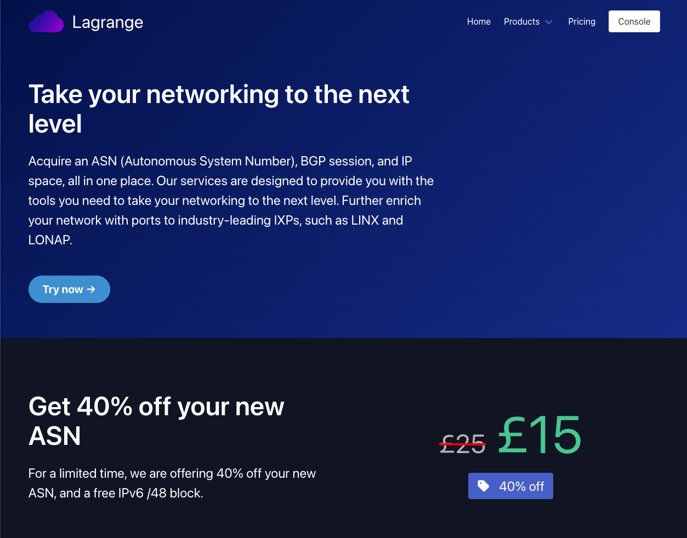
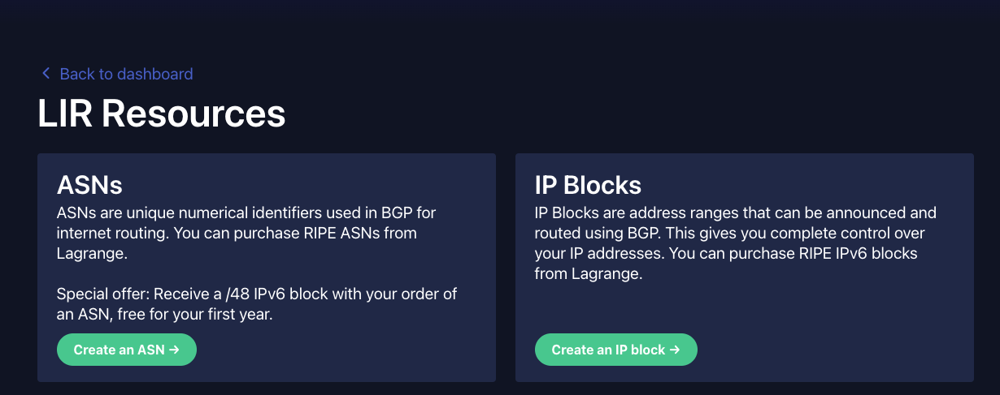
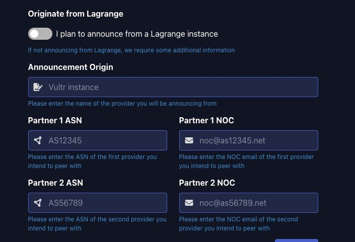
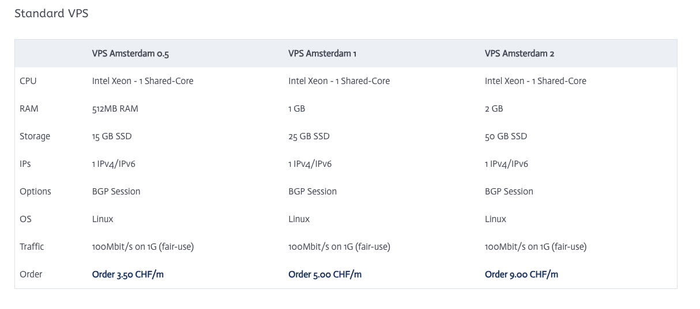
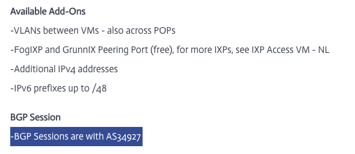
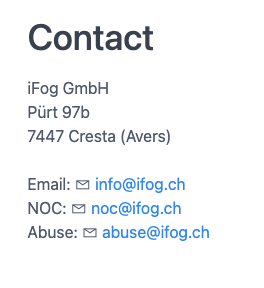
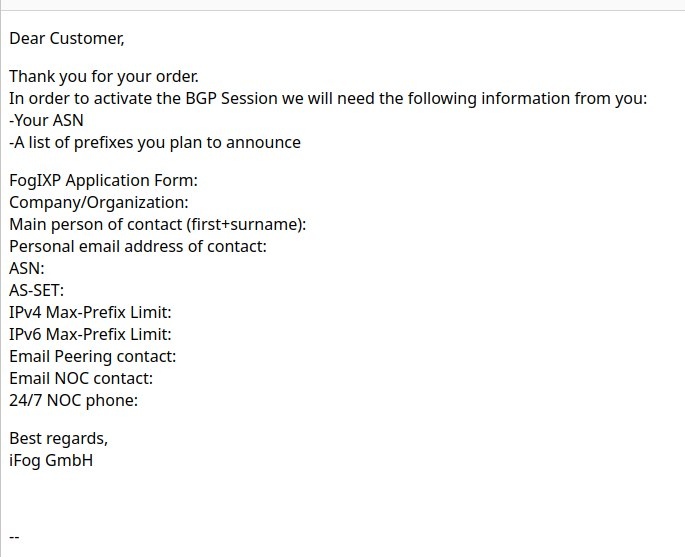
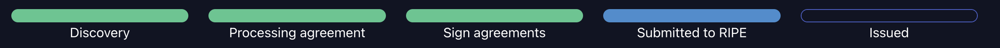
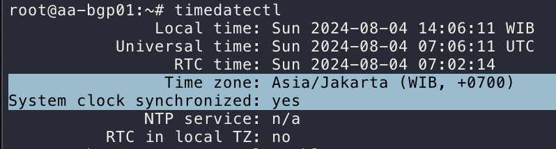

# Personal ASN dan IPv6

Last Update: 25 March 2024

# Part 1: ASN Application & Preparation

## ASN Application via Lagrange

<aside>
⚠️ Disclaimer: Tidak ada sponsor dari Lagrange cuman discount

</aside>

[https://lagrange.cloud/next-level-networking](https://lagrange.cloud/next-level-networking)



Pendaftaran ASN melalui Lagrange per tanggal 25 Maret 2024 ada discount 40% off dari £25 ke £15.

1. Untuk memulai aplikasi ASN, bisa langsung “Try now” dan lakukan Register akun Lagrange.
2. Langsung aja “Create an ASN” di page [https://lagrange.cloud/console/lir](https://lagrange.cloud/console/lir)
    
    
    
3. Ikutin proses purchasingnya.
4. Setelah itu akan ada Applicationnya, pilih guided, nanti akan diarahkan untuk proses pembuatan akun dan pembuatan object di RIPE. kalau bingung apa yang di isi bisa juga mengacu ke video dibawah:
    1. Video pembuatan object di RIPE 
        
        [Rifqi Arief in IPv6 Indonesia](https://t.me/IPv6_Indonesia/104851/110743)
        
    2. Pastikan utk mencatat beberapa informasi dibawah saat pembuatan:
        1. `RIPE ADMIN-C`: [Singkatan_Nama][Identifier]-RIPE (generate dari RIPE)
        2. `RIPE MNT (mnt-by)`: bebas tapi unique
        3. `Address`: alamat personal
        4. `abuse-c`: ACR[Identifier]-RIPE(generate saat mengisi abuse-c melalui logo lonceng)
        5. `mnt-ref`: INFERNO-MNT (dari Lagrange) dan mnt-by (punya sendiri)
        6. `Organisation`: ORG-[Singkatan_Nama][IdentifierOrg]-RIPE (generate dari RIPE)
5. Di proses ini akan ada beberapa submission di portal Lagrange yang membutuhkan informasi diatas

## VPS support BGP Session



Jika sudah sampai page ini, proses selanjutnya adalah pembelian VPS yang support BGP session.

<aside>
⚠️ Pastikan VPS yang disewa berada pada region EU, seperti Amsterdam, Frankfurt, UK

</aside>

<aside>
⚠️ Disclaimer: Tidak ada sponsor dari iFog (cuman harga cukup terjangkau)

</aside>

1. Pilih VPS pada region EU (kasus saya pilih di Amsterdam 1) [https://ifog.ch/en/vps](https://ifog.ch/en/vps)
    
    
    
2. Ikutin proses purchasingnya (payment via CC atau Paypal)
3. Beberapa catatan saat konfigurasi VPS:
    1. Hostname: FQDN [hostname].[domain].[tld]
    2. Password: optional
    3. BGP Session: ✅ 
    4. FogIXP Peering port: ✅
    5. Additional v6 BGP Transit via ASxxxx: optional 
4. Simpan Invoice untuk nanti di upload ke ticket Lagrange
5. untuk pengisian Lagrange bisa menggunakan panduan berikut:
    1. Partner 1 ASN: ASN punya iFog atau VPS provider lainnya. [https://ifog.ch/en/vps/vps-amsterdam](https://ifog.ch/en/vps/vps-amsterdam)
        
        
        
    2. Partner 1 NOC: email dari iFog atau VPS provider lainnya. [https://fognet.ch/contact](https://fognet.ch/contact)
        
        
        
    3. Partner 2 ASN dan Partner 2 NOC: bisa request sponsor ke grup telegram [https://t.me/IPv6_Indonesia](https://t.me/IPv6_Indonesia). Saya request sponsor ke om @malhuda (Thanks om bantuannya)
    4. Setelah submit, upload invoice dari iFog atau VPS provider lainnya di halaman ticket
    5. Jika terima email seperti ini dari VPS provider bisa balas “My ASN is still in the process of application, I will contact you after it finished.”
        
        
        
    6. Tunggu deh sampe di ASN diterbitkan.

## Issuing Process



Setelah ini akan ada beberapa proses approval yang dibutuhkan dari Lagrange:

1. Document Agreement: Tanda tangan menggunakan DocuSign. Pastikan masukkan kode akses yang sesuai, ada pada tiket. `Position` pada kolom tanda tangan bisa di isi `Individual`.
2. Upload ID: KTP/SIM/Paspor

---

### Catatan Petinggi

- Tapi kalau mau lepas VPS EU, wajib cari upstream ke EU, Ke netassist atau udn aja atau bgptunnel
- [https://my.bgptunnel.com/](https://my.bgptunnel.com/) pake ini om buat presence di EU kalo nanti lepas VPS EU

## Peering Application

Setelah ASN terbit, akan ada permintaan utk pengisian Application From dari FogIXP (jika VPS di iFog):

*FogIXP Application Form:*

- `Company/Organization`: Full Name
- `Main person of contact (first+surname)`: Full Name
- `Personal email address of contact`: Email sendiri
- `ASN`: ASxxxxxx
- `AS-SET`: ASxxxxxx:AS-SET (buat object baru di RIPE-DB dan add ASN milik sendiri sebagai member, + button)
- `IPv4 Max-Prefix Limit`: 0 atau sesuai yg ingin di announce
- `IPv6 Max-Prefix Limit`:  2 atau sesuai yg ingin di announce
- `Email Peering contact`: Email sendiri
- `Email NOC contact`: Email sendiri
- `24/7 NOC phone`: No Telp Sendiri
- `A list of prefixes you plan to announce`: Prefix yang didapat dari Lagrange atau sponsor

### Catatan Petinggi

- AS-SET full itu ada ASNnya didepan
    - Sudah gak bisa pakai AS-SET pendek
    - Karena yah ada drama sblmnya hahhaa
    - Tapi kalo penasaran, coba aja
- AS-UPSTREAMS itu untuk upstream ya
    - JANGAN DIMASUKKAN KE AS-SET UTAMA
    - Pisah ya om
- AS-SET khusus ASN sendiri dan downstream dan AS-SET khusus upstream
- ...Untuk ASXXXXXX:AS-UPSTREAMS itu ditaruh di whois ASN aja, buat import export....
    - Jangan dimasukkan / dikirimkan ke peeringdb maupun upstream, langsung digaplok, 100%
    - Yang dikirim ke peeringdb  maupun upstream, yang ASXXXXXX:AS-SET
    - Nah, pengisiannya juga membernya hanya ASN itu, dan downstream
    - Selain itu jangan coba coba masukkin, nnti bisa bisa ditabok lagi

## PeeringDB

1. Lakukan registrasi di PeeringDB [https://www.peeringdb.com/register](https://www.peeringdb.com/register).
2. Masukkan email yang terdaftar di RIPE.
3. Masukkan ASN dan Organization (Nama Lengkap) pada bagian Affiliate with Organization.

Setelah Affiliate sudah di approve, dapat melengkapi informasi di organization (full name, di menu dekat profile ) dan networks (ASN, ada di dalam organization)

## Configure route6 in RIPE DB

Setelah mendapatkan alokasi IP, buat object baru di RIPE DB dengan type route6

`mnt-by`: mnt_sendiri dan yang memberi alokasi

`route6`: prefix IPv6 (xxxx:xxx::/48)

`origin`: AS_number

Jika saat membuat route6 gagal (kasus saya alokasi dari Lagrange dengan mnt INFERNO-MNT), dapat membuat tiket di portal Lagrange dengan menyertakan prefix dan mnt_sendiri.

## Request RPKI pada block IP

Setelah mendapatkan block IP bisa request ke penyedia prefix untuk setup RPKI melalui open ticket.

## Install VPS

Jika berlangganan di iFog, dapat melakukan instalasi VM secara manual setelah mendapatkan akses. rekomendasi OS adalah debian 12 dan disetup secara minimal (tanpa gui).

Untuk mempermudah dapat menambahkan konfigurasi dibawah pada file  `~/.ssh/config`.

```yaml
Host bgp-server
  HostName external_ip
  User username
  IdentityFile /path/to/private/key
```

dan dapat melakukan ssh dengan command dibawah:

```yaml
ssh bgp-server
```

# Part 2: Config BGP

## Preparation

1. Edit network interfaces & sesuaikan masing masing parameter <> (nama interface mungkin berbeda)
    
    ```bash
    vim /etc/network/interfaces
    ```
    
    ```bash
    # This file describes the network interfaces available on your system
    # and how to activate them. For more information, see interfaces(5).
    
    source /etc/network/interfaces.d/*
    
    # The loopback network interface
    auto lo
    iface lo inet loopback
    
    # The primary network interface
    allow-hotplug ens18
    iface ens18 inet static
    	address <IPv4_Public>/<Subnet_mask>
    	gateway <IPv4_Gateway>
    	# dns-* options are implemented by the resolvconf package, if installed
    	dns-nameservers 9.9.9.9
    	dns-search <domain>
    	# disable multicast
    	up ip link set dev $IFACE mtu 1500
      up ip link set multicast off dev $IFACE
    
    iface ens18 inet6 static
    	address <IPv6 Public>
    	netmask <Subnet_mask>
    	gateway <IPv6_Gateway>
    	# dns-* options are implemented by the resolvconf package, if installed
    	dns-nameservers 2620:fe::fe
    	dns-search <domain>
    	# disable multicast
    	up ip link set dev $IFACE mtu 1500
      up ip link set multicast off dev $IFACE
    
    # The secondary network interface to FogIXP
    iface ens19 inet6 static
    	address <IPv6 Public>
    	netmask <Subnet_mask>
    	gateway <IPv6_Gateway>
    	# dns-* options are implemented by the resolvconf package, if installed
    	dns-nameservers 2620:fe::fe
    	dns-search <domain>
    	# disable multicast
    	up ip link set dev $IFACE mtu 1500
      up ip link set multicast off dev $IFACE
    ```
    
    ```bash
    systemctl restart networking
    ```
    
2. Edit sysctl.conf (backup default jika diperlukan) 
    
    ```bash
    # cp /etc/sysctl.conf{,.default} 
    vim /etc/sysctl.conf
    ```
    
    ```bash
    fs.file-max = 16777216
    fs.nr_open = 1073741824
    kernel.hung_task_timeout_secs = 0
    kernel.msgmax = 65536
    kernel.msgmnb = 65536
    net.core.default_qdisc = cake
    net.core.netdev_max_backlog = 30000
    net.core.rmem_default = 67108864
    net.core.rmem_max = 67108864
    net.core.somaxconn = 65536
    net.core.wmem_max = 67108864
    net.ipv4.conf.all.accept_redirects = 0
    net.ipv4.conf.all.accept_source_route = 0
    net.ipv4.conf.all.arp_announce = 1
    net.ipv4.conf.all.arp_filter = 1
    net.ipv4.conf.all.arp_ignore = 2
    net.ipv4.conf.all.forwarding = 1
    net.ipv4.conf.all.ignore_routes_with_linkdown = 1
    net.ipv4.conf.all.rp_filter = 0
    net.ipv4.conf.all.secure_redirects = 0
    net.ipv4.conf.all.send_redirects = 0
    net.ipv4.fib_multipath_use_neigh = 1
    net.ipv4.icmp_echo_ignore_broadcasts = 1
    net.ipv4.icmp_errors_use_inbound_ifaddr = 1
    net.ipv4.icmp_ignore_bogus_error_responses = 1
    net.ipv4.icmp_msgs_per_sec = 2500
    net.ipv4.icmp_ratelimit = 0
    net.ipv4.igmp_max_memberships = 100
    net.ipv4.ip_forward = 1
    net.ipv4.ip_local_port_range = 1024 65535
    net.ipv4.neigh.default.base_reachable_time_ms = 14400000
    net.ipv4.neigh.default.gc_thresh1 = 1024
    net.ipv4.neigh.default.gc_thresh2 = 2048
    net.ipv4.neigh.default.gc_thresh2 = 8192
    net.ipv4.neigh.default.gc_thresh3 = 4096
    net.ipv4.neigh.default.gc_thresh3 = 16384
    net.ipv4.route.max_size = 1073741824
    net.ipv4.tcp_congestion_control = bbr
    net.ipv4.tcp_dsack = 1
    net.ipv4.tcp_fin_timeout = 30
    net.ipv4.tcp_keepalive_time = 120
    net.ipv4.tcp_l3mdev_accept = 1
    net.ipv4.tcp_max_syn_backlog = 8192
    net.ipv4.tcp_mem = 4194304 16777216 67108864
    net.ipv4.tcp_no_metrics_save = 1
    net.ipv4.tcp_rmem = 4194304 16777216 67108864
    net.ipv4.tcp_sack = 1
    net.ipv4.tcp_syn_retries = 3
    net.ipv4.tcp_synack_retries = 3
    net.ipv4.tcp_syncookies = 1
    net.ipv4.tcp_timestamps = 1
    net.ipv4.tcp_window_scaling = 1
    net.ipv4.tcp_wmem = 4194304 16777216 67108864
    net.ipv6.conf.all.accept_ra_defrtr = 0
    net.ipv6.conf.all.accept_ra_pinfo = 0
    net.ipv6.conf.all.accept_ra_rtr_pref = 0
    net.ipv6.conf.all.accept_redirects = 0
    net.ipv6.conf.all.accept_source_route = 0
    net.ipv6.conf.all.autoconf = 0
    net.ipv6.conf.all.dad_transmits = 0
    net.ipv6.conf.all.forwarding = 1
    net.ipv6.conf.all.ignore_routes_with_linkdown = 1
    net.ipv6.conf.all.router_solicitations = -1
    net.ipv6.icmp.ratelimit = 0
    #net.ipv6.conf.all.send_redirects = 0
    net.ipv6.neigh.default.base_reachable_time_ms = 14400000
    net.ipv6.neigh.default.gc_thresh1 = 1024
    net.ipv6.neigh.default.gc_thresh2 = 2048
    net.ipv6.neigh.default.gc_thresh2 = 8192
    net.ipv6.neigh.default.gc_thresh3 = 4096
    net.ipv6.neigh.default.gc_thresh3 = 16384
    net.ipv6.route.max_size = 32768000
    vm.max_map_count = 1048575
    vm.swappiness = 100
    
    net.ipv6.conf.all.accept_ra = 0
    #net.ipv6.conf.all.proxy_ndp = 1
    
    #net.netfilter.nf_conntrack_acct = 1
    #net.netfilter.nf_conntrack_checksum = 0
    #net.netfilter.nf_conntrack_max = 65535
    #net.netfilter.nf_conntrack_tcp_timeout_established = 7440
    #net.netfilter.nf_conntrack_udp_timeout = 60
    #net.netfilter.nf_conntrack_udp_timeout_stream = 180
    #net.netfilter.nf_conntrack_helper = 1
    
    # net.ipv6.conf.all.disable_ipv6 = 1
    ```
    
    Config sesuai interface IXP yang dimiliki
    
    ```bash
    ### Disable multicast FogIXP Interface ###
    net.ipv4.conf.<interface_name>.arp_announce = 1
    net.ipv4.conf.<interface_name>.arp_filter = 1
    net.ipv4.conf.<interface_name>.arp_ignore=2
    net.ipv4.conf.<interface_name>.arp_notify=1
    net.ipv4.conf.<interface_name>.proxy_arp = 0
    net.ipv4.conf.<interface_name>.rp_filter=0
    net.ipv4.neigh.default.gc_interval = 30
    net.ipv4.neigh.<interface_name>.base_reachable_time_ms = 14400000
    net.ipv4.neigh.<interface_name>.gc_stale_time = 60
    net.ipv6.conf.<interface_name>.accept_ra = 0
    net.ipv6.conf.<interface_name>.autoconf = 0
    net.ipv6.conf.<interface_name>.router_solicitations = -1
    net.ipv6.neigh.default.gc_interval = 30
    net.ipv6.neigh.<interface_name>.base_reachable_time_ms = 14400000
    net.ipv6.neigh.<interface_name>.gc_stale_time = 60
    ```
    
    ```bash
    sysctl -p
    # or
    reboot
    ```
    
3. Pre Setup (optional)
    
    https://github.com/Xeoncross/lowendscript, scope:
    
    - update_timezone
    - remove_unneeded
    - update_upgrade
    - install_dash
    - install_vim
    - install_nano
    - install_htop
    - install_mc
    - install_iotop
    - install_iftop
    - install_syslogd
    - install_curl
    - apt_clean
    
    ```bash
    wget --no-check-certificate https://raw.github.com/Xeoncross/lowendscript/master/setup-debian.sh
    chmod a+rx setup-debian.sh
    ./setup-debian.sh system
    ```
    
4. Timezone and NTP
    
    ```bash
    apt install ntp -y
    ```
    
    Edit NTP configuration
    
    ```bash
    vim /etc/ntp.conf
    ```
    
    ```bash
    server 0.debian.pool.ntp.org iburst
    server 1.debian.pool.ntp.org iburst
    server 2.debian.pool.ntp.org iburst
    server 3.debian.pool.ntp.org iburst
    ```
    
    ```bash
    sudo systemctl restart ntp
    ```
    
    Set Timezone and see status
    
    ```bash
    timedatectl set-timezone Asia/Jakarta
    timedatectl
    ```
    
    
    

## Konfigurasi Pathvector

1. Install Pathvector dan Bird2
    
    ```bash
    curl https://repo.pathvector.io/pgp.asc > /usr/share/keyrings/pathvector.asc
    echo "deb [signed-by=/usr/share/keyrings/pathvector.asc] https://repo.pathvector.io/apt/ stable main" > /etc/apt/sources.list.d/pathvector.list
    apt update && apt install -y pathvector bird2
    ```
    
2. Konfigurasi /etc/pathvector.yml
    
    ```bash
    vim /etc/pathvector.yml
    ```
    
    first block
    
    ```yaml
    asn: <your_asn>
    bgpq-args: "-S AFRINIC,APNIC,ARIN,LACNIC,RIPE"
    default-route: false
    irr-query-timeout: 30
    irr-server: "rr.ntt.net"
    merge-paths: true
    peeringdb-api-key: "<peeringdb_api_key>"
    peeringdb-query-timeout: 30
    prefixes:
      - "<prefix_plan_to_be_announce>"
      - "<prefix_plan_to_be_announce>"
    router-id: "<an_ipv4_address>"
    rtr-server: "172.65.0.2:8282"
    
    ```
    
    Catatan
    
    - Ubahlah your_asn menjadi ASN anda.
    - Lalu, IRR hanya valid untuk AFRINIC, APNIC, ARIN, LACNIC, RIPE
    - Tidak menerima rute *default*
    - IRR server menggunakan NTT
    - Ubah peeringdb_api_key dengan kunci milik anda sendiri. Hak akses pada PeeringDB **gunakan hanya baca**
    - Ubahlah prefix_plan_to_be_announce dengan prefix yang akan di gunakan.
    - Ubahlah router-id dengan IPv4 VPS anda (atau gunakan IP lokal jika memang tidak ada IP publiknya (karena hanya sebagai pengenal saja)).
    - rtr-server menggunakan Cloudflare
    
    Aktivasi kernel karena akan menggunakan full table
    
    ```yaml
    kernel:
      learn: true
    
    # BGP Large Communities
    # <your_asn>:1:1 - Learned from upstream
    # <your_asn>:1:2 - Learned from route server
    # <your_asn>:1:3 - Learned from peer
    # <your_asn>:1:4 - Learned from downstream
    # <your_asn>:1:5 - Learned from iBGP
    ```
    
    Template (ganti your_asn dengan ASN yang dimiliki gunakan sesuai kebutuhan)
    
    ```yaml
    templates:
      upstream:
        add-on-import:
          - <your_asn>:1:1
        allow-local-as: true
        announce:
          - <your_asn>:1:4
        local-pref: 100
        remove-all-communities: <your_asn>
    
      routeserver:
        add-on-import:
          - <your_asn>:1:2
        announce:
          - <your_asn>:1:4
        auto-import-limits: true
        enforce-first-as: false
        enforce-peer-nexthop: false
        filter-transit-asns: true
        local-pref: 200
        remove-all-communities: <your_asn>
    
      peer:
        add-on-import:
          - <your_asn>:1:3
        announce:
          - <your_asn>:1:4
        auto-as-set: true
        auto-import-limits: true
        filter-irr: true
        filter-transit-asns: true
        irr-accept-child-prefixes: true
        local-pref: 300
        remove-all-communities: <your_asn>
    
      downstream:
        add-on-import:
          - <your_asn>:1:4
        allow-blackhole-community: true
        announce:
          - <your_asn>:1:1
          - <your_asn>:1:2
          - <your_asn>:1:3
        auto-as-set: true
        auto-import-limits: true
        filter-irr: true
        filter-transit-asns: true
        irr-accept-child-prefixes: true
        local-pref: 400
        remove-all-communities: <your_asn>
    
      ibgp:
        allow-local-as: true
        asn: <your_asn>
        direct: true
        enforce-first-as: false
        enforce-peer-nexthop: false
        filter-irr: false
        filter-rpki: false
        next-hop-self: true
        remove-all-communities: <your_asn>
    ```
    
    Catatan:
    
    - Template `upstream` hanya digunakan untuk transit AS
    - Template `routeserver` hanya digunakan untuk peering ke routeserver
    - Template `peer` hanya digunakan untuk melakukan bilateral peering
    - Template `downstream` hanya boleh dipakai untuk melakukan downstream AS pihak lain
    - Template `ibgp` hanya digunakan untuk AS yang sama
    
    Template peers (gunakan sesuai kebutuhan)
    
    ```yaml
    peers:
    ############
    # UPSTREAM #
    ############
      upstream_name:
        asn: neigh_asn
        disabled: false
        listen6: "<local_address>"
        local-pref: 100
        neighbors:
          - "<neigh_address>"
        template: upstream
    
    ###############
    # ROUTESERVER #
    ###############
      routeserver_name:
        asn: neigh_asn
        disabled: false
        listen4: "<local_address>"
        listen6: "<local_address>"
        local-pref: 200
        neighbors:
          - "<neigh_address>"
          - "<neigh_address>"
        template: routeserver
    
    ###########
    # PEERING #
    ###########
      peering_name:
        asn: neigh_asn
        disabled: false
        listen6: "<local_address>"
        local-pref: 300
        neighbors:
          - "<neigh_address>"
        template: peer
    
    ############
    # INTERNAL #
    ############
      ibgp_name:
        add-on-import:
          - <your_asn>:1:1
        announce:
          - <your_asn>:1:1
        disabled: false
        listen6: "<local_address>"
        local-port: 179
        local-pref: 150
        neighbor-port: 179
        neighbors:
          - "<neigh_address>"
        template: ibgp
    ```
    
    Generate bird config:
    
    ```yaml
    pathvector generate
    ```
    
    Cek Routing sudah masuk atau blm
    
    ```yaml
    ip -6 route
    ```
    
    Cek status BGP
    
    ```yaml
    birdc show protocol
    ```
    
3. Set cron untuk update IRR prefix lists dan PeeringDB prefix limits setiap 12 jam.
    
    ```bash
    #crontab -e
    0 */12 * * * pathvector generate
    ```
    

## Reference

[https://pathvector.io/docs/installation](https://pathvector.io/docs/installation)

[https://t.me/IPv6_Indonesia/104851](https://t.me/IPv6_Indonesia/104851)

[https://www.youtube.com/watch?v=a51noB2brjM](https://www.youtube.com/watch?v=a51noB2brjM)

# Part 3: Set Up Interface

1. Buat dummy interface script
    
    ```bash
    vim /usr/local/bin/setup-dummy-interface.sh
    ```
    
    ```bash
    #!/bin/bash
    ip link add dummy0 type dummy
    ip addr add <YOUR_IPV4_INTERFACE_IP>/24 dev dummy0
    ip addr add <YOUR_IPV6_INTERFACE_IP>/64 dev dummy0
    ip link set dummy0 up
    ```
    
    ```bash
    chmod +x /usr/local/bin/setup-dummy-interface.sh
    ```
    
2. Buat Systemd Service 
    
    ```bash
    vim /etc/systemd/system/dummy-interface.service
    ```
    
    ```bash
    [Unit]
    Description=Setup Dummy Interface
    After=network.target
    
    [Service]
    ExecStart=/usr/local/bin/setup-dummy-interface.sh
    RemainAfterExit=yes
    
    [Install]
    WantedBy=multi-user.target
    ```
    
    ```bash
    systemctl enable dummy-interface.service
    systemctl start dummy-interface.service
    ```
    
3. Test Koneksi
    1. Ping
        
        ```bash
        ping -I <YOUR_IPV4_INTERFACE_IP> 8.8.8.8
        ping6 -I <YOUR_IPV6_INTERFACE_IP> 2001:4860:4860::8888
        ```
        
    2. Curl
        
        ```bash
        curl --interface <YOUR_IPV4_INTERFACE_IP> -4 ifconfig.me
        curl --interface <YOUR_IPV6_INTERFACE_IP> -6 ifconfig.me
        ```
        
    3. mtr
        
        ```bash
        mtr -I dummy0 google.com
        ```
        

# Part 4: Tunnel ke Rumah atau DC

### Main Server (BGP Router)

1. Install wireguard
    
    ```bash
    apt update
    apt install wireguard
    ```
    
2. Generate Wireguard Private dan Public key
    
    ```bash
    wg genkey | tee /etc/wireguard/private.key
    chmod 600 /etc/wireguard/private.key
    cat /etc/wireguard/private.key | wg pubkey | tee /etc/wireguard/public.key
    
    # Baris Pertama Private Key
    # Baris Kedua Public Key -> simpan untuk konfigurasi client server
    ```
    
3. Buat Konfigurasi Wireguard di /etc/wireguard/wg0.conf
    
    ```bash
    [Interface]
    PrivateKey = <Your-Main-Server-Private-Key>
    Address = <Your-Main-Server-IPv6-Allocation>/64
    ListenPort = 51820
    Table = off
    
    [Peer]
    PublicKey = <Your-Client-Public-Key> #setelah digenerate
    AllowedIPs = <Your-Client-IPv6-Allocation>/128
    ```
    
4. Enable dan Start Wireguard Setelah Public Key Client di generate
    
    ```bash
    systemctl enable wg-quick@wg0
    systemctl start wg-quick@wg0
    ```
    
5. Konfigurasi forwarding
    
    ```bash
    # Port Forwarding for IPv4 - opsional jika announce IPv4
    net.ipv4.ip_forward=1
    
    # Port forwarding for IPv6
    net.ipv6.conf.all.forwarding=1
    ```
    
6. Apply konfigurasi forwarding
    
    ```bash
    sudo sysctl -p
    ```
    

### Client Server (Home Server) - Debian/Ubuntu

1. Install wireguard
    
    ```bash
    apt update
    apt install wireguard
    ```
    
2. Generate Wireguard Private dan Public key
    
    ```bash
    wg genkey | tee /etc/wireguard/private.key
    chmod 600 /etc/wireguard/private.key
    cat /etc/wireguard/private.key | wg pubkey | tee /etc/wireguard/public.key
    
    # Baris Pertama Private Key
    # Baris Kedua Public Key -> Masukkan ke konfigurasi main server
    ```
    
3. Buat Konfigurasi Wireguard di /etc/wireguard/wg0.conf
    
    ```bash
    [Interface]
    PrivateKey = <Your-Client-Private-Key>
    Address = <Your-Client-IPv6-Allocation>/64
    DNS = 2606:4700:4700::1111
    DNS = 2606:4700:4700::1001
    
    [Peer]
    PublicKey = <Your-Main-Server-Public-Key>
    Endpoint = <Main-Server-Public-IPv6>:51820
    AllowedIPs = ::/0
    PersistentKeepalive = 25
    ```
    
4. Enable dan Start Wireguard Setelah Public Key Client digenerate
    
    ```bash
    systemctl enable wg-quick@wg0
    systemctl start wg-quick@wg0
    ```
    

### Uji Coba di Client Server

1. Ping
    
    ```bash
    ping6 -I <YOUR_IPV6_INTERFACE_IP> 2001:4860:4860::8888
    ```
    
2. Curl
    
    ```bash
    curl --interface <YOUR_IPV6_INTERFACE_IP> -6 ifconfig.me
    ```
    
3. mtr
    
    ```bash
    mtr -I dummy0 google.com
    ```
    

## Miscellaneous

### Generate Wireguard QRCode

```bash
apt install qrencode
qrencode -t ansiutf8 < /etc/wireguard/wg-client.conf
```

[https://www.cyberciti.biz/faq/how-to-generate-wireguard-qr-code-on-linux-for-mobile/](https://www.cyberciti.biz/faq/how-to-generate-wireguard-qr-code-on-linux-for-mobile/)

# Reference

- [https://www.reddit.com/r/homelab/comments/153uwj9/want_to_get_started_with_bgp_links_that_helped_me/](https://www.reddit.com/r/homelab/comments/153uwj9/want_to_get_started_with_bgp_links_that_helped_me/)
- [https://chown.me/blog/getting-my-own-asn](https://chown.me/blog/getting-my-own-asn)
- [https://amanjuman.medium.com/setting-up-bgp-routing-with-pathvector-and-bird-on-ubuntu-3f8b92a01669](https://amanjuman.medium.com/setting-up-bgp-routing-with-pathvector-and-bird-on-ubuntu-3f8b92a01669)
- [https://www.animmouse.com/p/my-asn-journey-configuring-bgp-on-vps/](https://www.animmouse.com/p/my-asn-journey-configuring-bgp-on-vps/)
- [https://www.animmouse.com/p/my-asn-journey-bring-home-the-ipv6-via-wireguard/](https://www.animmouse.com/p/my-asn-journey-bring-home-the-ipv6-via-wireguard/)
- [https://docs.vultr.com/configuring-bgp-on-vultr](https://docs.vultr.com/configuring-bgp-on-vultr)