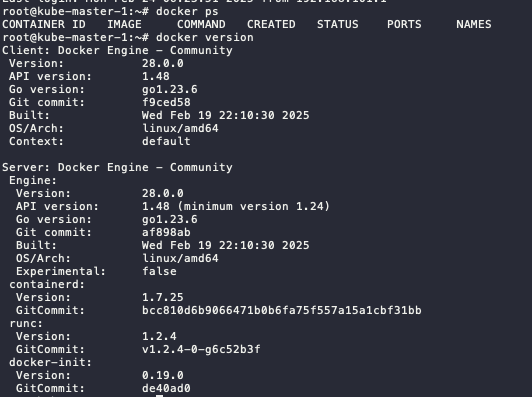
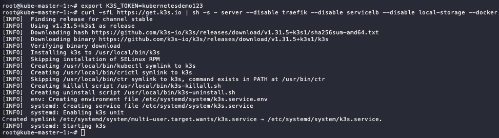
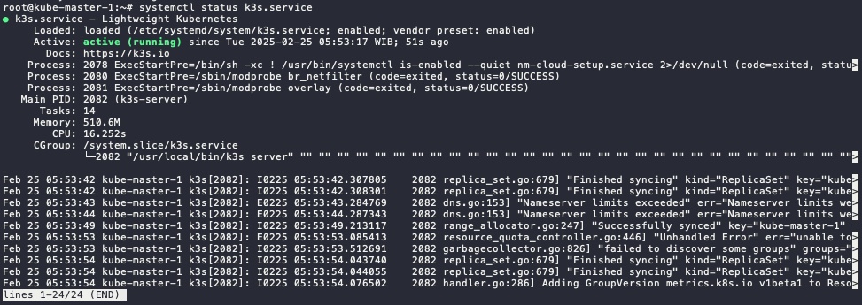
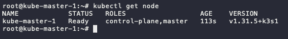
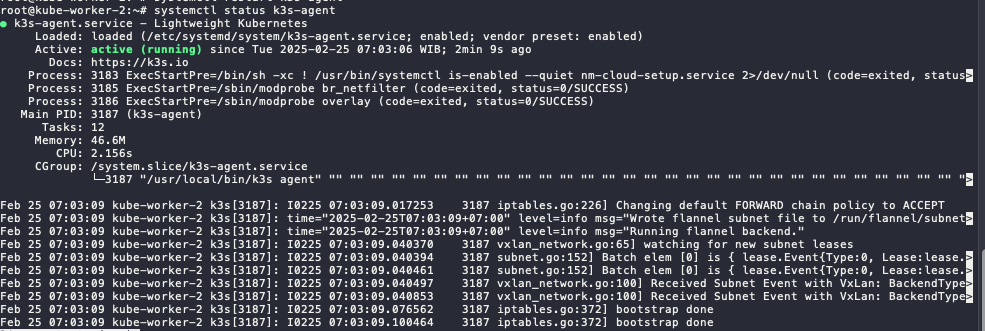

# Setup Non HA Kubernetes using K3S

Last Update: 25 February 2025

# K3S

### Resources

- [Quick Start K3S](https://docs.k3s.io/quick-start)
- [K3S: Setup dan Konfigurasi Kubernetes Cluster](https://www.youtube.com/watch?v=w7qoTksCQow)
- [MetalLB: Installation with Helm](https://metallb.io/installation/#installation-with-helm)
- [Helm: Installing from APT - Ubuntu/Debian](https://helm.sh/docs/intro/install/#from-apt-debianubuntu)

# Non-HA Control Plan Setup and Configuration


The implementation Scenario will be configured:

- 1 Master Node
- 2 Worker Node

These three nodes will be deployed in Proxmox VE, with each specification of node:

- 4 vCPU
- 16 GB of memory
- 50 GB of storage
- Ubuntu 20.04

# Step by step

## VM Setup

1. Update and upgrade the package repository to the newest version.
    
    ```bash
    sudo apt update -y
    sudo apt upgrade -y
    ```
    
2. (optional) rename and set /etc/host for each node became:
    1. Master node → `kube-master-1`
    2. Worker node → `kube-worker-1`, `kube-worker-2`
    
    ```bash
    #edit /etc/hosts and add this at the end of file (adjust ip address)
    10.0.2.200 kube-master-1
    10.0.2.199 kube-worker-1
    10.0.2.198 kube-worker-2
    ```
    
3. Reboot to finalize the upgrade and apply the hostname.
4. Install docker with this script ([Docker: Install using the conveniencescript](https://docs.docker.com/engine/install/ubuntu/#install-using-the-convenience-script))
    
    ```bash
    curl -fsSL https://get.docker.com -o get-docker.sh
    sudo sh get-docker.sh
    ```
    
5. Check docker command and version
    
    ```bash
    docker ps
    docker version
    ```
    
    
    

## Master Node Setup

1. Defined the K3s token. Save this token and make sure this token is the same for all nodes
    
    ```bash
    export K3S_TOKEN=kubernetesdemo123
    ```
    
2. The installation of master node, using this script:
    1. install the server as master node
    2. disable Traefik for ingress → will use Nginx ingress
    3. disable Servicelb → will use MetalLB
    4. disable local-storage → will use Ceph CSI
    5. declare to use docker
    
    ```bash
    curl -sfL https://get.k3s.io | sh -s - server --disable traefik --disable servicelb --disable local-storage --docker
    ```
    
    
    
3. Check the service status, make sure it is active
    
    ```bash
    systemctl status k3s.service
    ```
    
    
    
4. Check kubectl command. It will display 1 node only (which is the master node).
    
    ```bash
    kubectl get node
    ```
    
    
    
    
    > ⚠️ if the get error `unable to read /etc/rancher/k3s/k3s.yml` , you can fix with this step.
    > 
    > ```bash
    > mkdir .kube
    > sudo cp /etc/rancher/k3s/k3s.yaml .kube/config.yaml
    > sudo chown $USER:$GROUP .kube/config.yaml
    > export KUBECONFIG=~/.kube/config.yaml
    > ```
    > 
    > or if you have not start the installation, you can add `--write-config 644` in the end of the script, like this:
    > 
    > ```bash
    > curl -sfL https://get.k3s.io | sh -s - server --disable traefik --disable servicelb --disable local-storage --docker --write-config 644
    > ```
    
    
    

## Worker Node Setup

Do this step for all the worker node, in this scenario will be `kube-worker-1` and `kube-worker-2`.

1. Defined the K3s token. Use the same token as defined in master node.
    
    ```bash
    export K3S_TOKEN=kubernetesdemo123
    ```
    
    <aside>
    ⚠️
    
    If you forget the token on the master node, you can check and on the master node on this file. Copy all the string.
    
    ```bash
    cat /var/lib/rancher/k3s/server/node-token
    ```
    
    </aside>
    
2. The installation of worker nodes, using this script:
    1. install the server as worker node (agent)
    2. declare to use docker
    3. define the server endpoint to master node ip or domain
    
    ```bash
    curl -sfL https://get.k3s.io | sh -s - agent --docker --server https://kube-master-1:6443
    ```
    
3. Check the service in the worker nodes
    
    ```bash
    systemctl status k3s-agent.service
    ```
    
    
    
4. Check kubectl command in master node. Now, it will display more than 1 node (which is the includes all the installed worker nodes).
    
    
    

<aside>
⚠️

If you stuck in when starting k3s-agent. Make sure worker node and master node can be connecting. it could be firewall, proxy server, or incorrect/mismatched MTU. Script below can be use for check the connectivity.

```bash
curl -ks https://ipaddress:6443/ping
```

</aside>

# Install and Configure services in the Master Node

because we disable some service in the master node. Now we are going to install it the replacement services.

## HELM - Package Manager Installation

1. Install Helm using script below (the latest script can be seen on the Helm docs):
    
    ```bash
    curl https://baltocdn.com/helm/signing.asc | gpg --dearmor | sudo tee /usr/share/keyrings/helm.gpg > /dev/null
    sudo apt-get install apt-transport-https --yes
    echo "deb [arch=$(dpkg --print-architecture) signed-by=/usr/share/keyrings/helm.gpg] https://baltocdn.com/helm/stable/debian/ all main" | sudo tee /etc/apt/sources.list.d/helm-stable-debian.list
    sudo apt-get update
    sudo apt-get install helm
    ```
    
2. Check the version
    
    ```bash
    helm version
    ```
    
    
    

## MetalLB - Load Balancer Installation and Configuration


### **Services**

- As default, all resources in Kubernetes are isolated, specifically pods.
- Pods are isolated by default. To enable communication between pods or with the external network, you need to configure  Services.
- There are several type of service:
    - ClusterIP → Default services, ClusterIP services provide an internal IP address within the cluster that other pods can use to communicate. They are not directly accessible from outside the cluster.
    - NodePort (Port 30000-32767) → NodePort services expose a port on each node in the cluster, allowing external access. The port range 30000-32767 is the default range.
    - LoadBalancer → LoadBalancer services provision an external load balancer that distributes traffic to multiple pods.

### Installation Step by Step:

1. Add metallb repository to helm
    
    ```bash
    helm repo add metallb https://metallb.github.io/metallb
    ```
    
2. Check the repo list
    
    ```bash
    helm repo ls
    ```
    
3. Search the metallb
    
    ```bash
    helm search repo metallb
    ```
    
    
    
4. Pull the metallb from the repository, it will download tgz file.
    
    ```bash
    # run this in the home dir or other directory
    helm pull metallb/metallb
    # extract the tgz
    tar xvf metallb-*
    ```
    
5. Change directory to metallb and if there any configuration changes, you can edit values.yaml
    
    ```bash
    cd metallb
    
    #optional
    vim values.yaml
    ```
    
6. Install metallb using helm
    - Set the chart name to metallb
    - Define the file to values.yaml
    - Put the namespace to metallb-system
    - Enable debug mode
    - Create metallb-system namespace
    
    ```bash
    helm install metallb -f values.yaml . -n metallb-system --debug --create-namespace
    ```
    
7. Check the status, if the status still init, wait until running.
    
    ```bash
    kubectl -n metallb-system get all
    kubectl -n metallb-system get pod -w
    ```
    
    
    

### Configuration

1. First, define the address pool on `ipaddresspool.yaml`
    
    ```yaml
    apiVersion: metallb.io/v1beta1
    kind: IPAddressPool
    metadata:
      name: default-pool
      namespace: metallb-system
    spec:
      addresses:
      - 10.0.2.11-10.0.2.100 #adjust this range
    ```
    
2. Apply the configuration
    
    ```bash
    kubectl apply -f ipaddresspool.yaml
    ```
    
    
    
3. Then, we define the L2 Advertisement config on `l2advertisement.yaml`
    
    ```yaml
    apiVersion: metallb.io/v1beta1
    kind: L2Advertisement
    metadata:
      name: default
      namespace: metallb-system
    spec:
      ipAddressPools:
      - default-pool
    ```
    
4. Apply the configuration
    
    ```bash
    kubectl apply -f l2advertisement.yaml
    ```
    
    
    

### Test the Load Balancer

1. Run demo app for the testing, the demo app using nginx image.
    
    ```bash
    kubectl run app-demo-1 --image=nginx --port=80
    
    #check the pod status, wait until running
    kubectl get pod
    ```
    
2. Since by default pod cannot communicate to outside, we need to create the service to expose the pods.
    
    ```bash
    kubectl expose pod app-demo-1 --type=LoadBalancer --target-port=80 --port=80 --name app-demo-1
    
    #check the pods and services
    kubectl get all
    ```
    
    
    
3. You can access the app using `EXTERNAL-IP` of `service/app-demo-1` and Nginx landing page will show up.
    
    
    

## Nginx - Ingress Controller Installation and Configuration


### Installation Step by Step:

1. Add nginx repository to helm
    
    ```bash
    helm repo add nginx-stable https://helm.nginx.com/stable
    ```
    
2. Check the repo list
    
    ```bash
    helm repo ls
    ```
    
3. Search the nginx
    
    ```bash
    helm search repo nginx
    ```
    
4. Pull the nginx-ingress from the repository, it will download tgz file.
    
    ```bash
    # run this in the home dir or other directory
    helm pull nginx-stable/nginx-ingress
    # extract the tgz
    tar xvf nginx-ingress-*
    ```
    
5. Change directory to nginx-ingress and edit `values.yaml` file.
    
    ```bash
    cd nginx-ingress
    
    # edit values.yaml
    vim values.yaml
    
    # locate ingressClass and change the variable below to true
    ...
    ingressClass:
    ...
    	setAsDefaultIngress: true
    ...
    ```
    
6. Install nginx-ingress using helm
    
    ```bash
    helm -n ingress install nginx-ingress -f values.yaml . --debug --create-namespace
    ```
    
7. Check the installation
    
    ```bash
    kubectl -n ingress get all
    ```
    
    
    
8. The `EXTERNAL-IP` is available and reachable, but since no resources use it, it display 404
    
    
    

### Testing the Ingress

1. Add bitname repository to helm
    
    ```bash
    helm repo add bitnami https://charts.bitnami.com/bitnami
    ```
    
2. Check the repo list
    
    ```bash
    helm repo ls
    ```
    
3. Search the nginx, we will use bitnami/nginx for the webserver nginx
    
    ```bash
    helm search repo nginx
    ```
    
4. Pull the nginx from the repository, it will download tgz file.
    
    ```bash
    # run this in the home dir or other directory
    helm pull bitnami/nginx
    # extract the tgz
    tar xvf nginx-* #make sure the nginx not nginx-ingress
    ```
    
5. Change directory to metallb and edit `values.yaml` file.
    
    ```bash
    cd nginx
    
    # edit
    vim values.yaml
    
    #locate these variables
    ...
    ingress:
    	enabled: true
    	...
    	hostname: nginx.demo.local # make sure this FQDN is pointing to the ingress IP
    	...
    	ingressClassName: "nginx" # check using `kubectl get ingressclass`
    ...
    ```
    
6. Install metallb using helm
    
    ```bash
    helm -n demo install demo-app -f values.yaml . --debug --create-namespace
    ```
    
7. Check the status, if the status still init, wait until running.
    
    ```bash
    kubectl -n demo get all
    kubectl -n demo get ingress
    ```
    
    
    
8. If you configure the FQDN in DNS or /etc/hosts correctly to ingress IP address, it will show like this
    
    
    

## CEPH CSI - StorageClass Installation and Configuration


**TODO** - i don't have CEPH cluster yet 🙈
