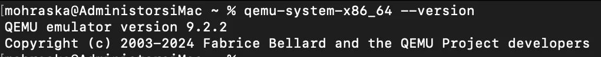
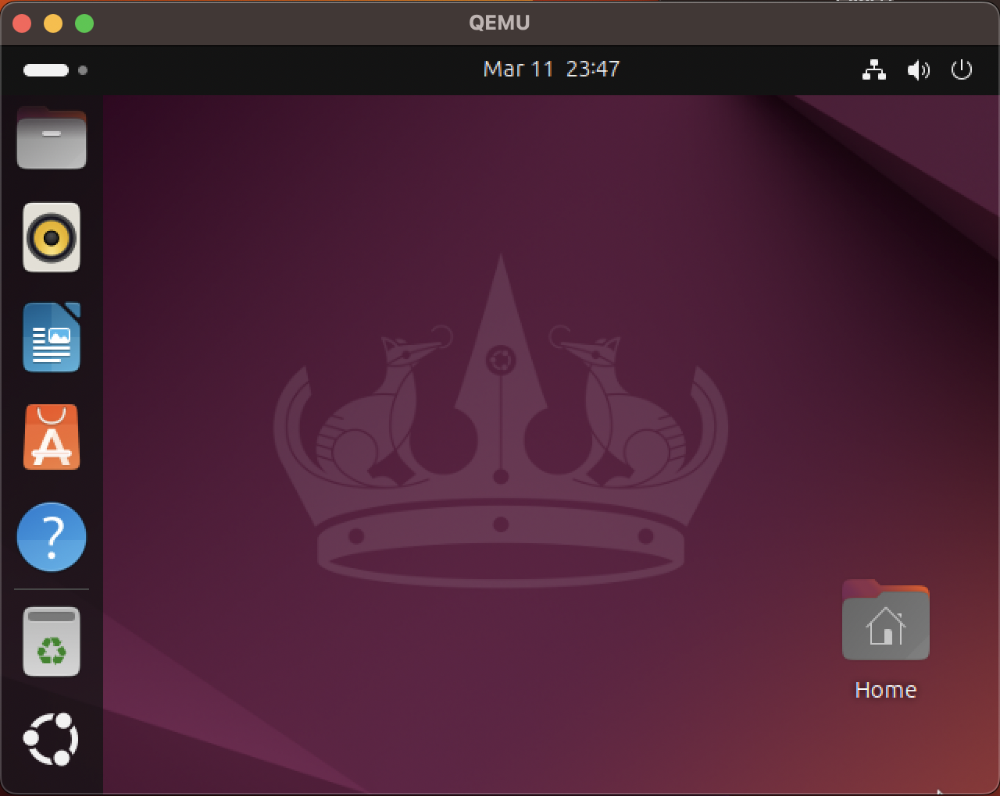
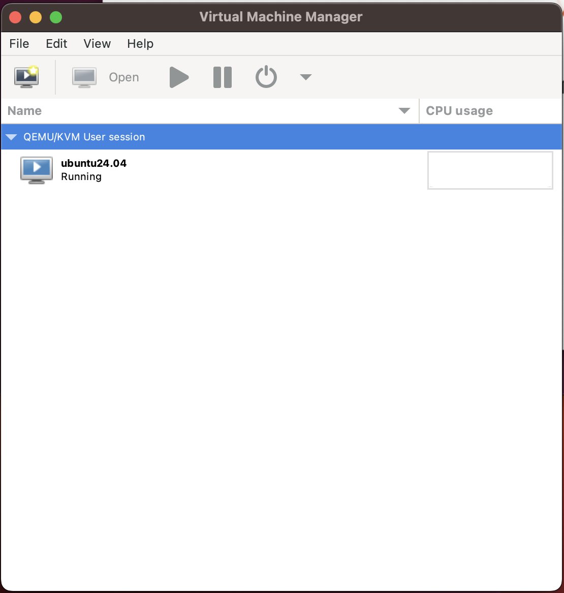

# Qemu and Virt-manager in macOS (Intel-based)

So, I found this old iMac (Retina 5K, 27-inch, 2017) lying around with pretty decent specs. I'm thinking of turning it into my dedicated x86 playground since my main machine is an M1 MacBook. First thing's first: getting Qemu and Virt-manager up and running for some virtual machine action. Yeah, I know there are other VM solutions like VMware or VirtualBox, but I want to stay familiar with what's common in enterprise environments (even if nobody's running macOS in production, haha!).

### Specification

iMac (Retina 5K, 27-inch, 2017)

- Processor: 4.2 GHz Quad-Core Intel Core i7
- Memory: 16 GB 2400 MHz DDR4
- OS Version: Ventura 13.7.4 (22H420)

### Step by Step: Qemu

1. First, we need Homebrew to install everything.
    
    Get it here: [https://brew.sh/](https://brew.sh/)
    
    ```bash
    /bin/bash -c "$(curl -fsSL <https://raw.githubusercontent.com/Homebrew/install/HEAD/install.sh>)"
    ```
    
2. Now, let's install Qemu itself.
    
    Check it out here: [https://formulae.brew.sh/formula/qemu](https://formulae.brew.sh/formula/qemu)
    
    ```bash
    brew install qemu
    ```
    
3. Verify the installation by checking the Qemu version.
    
    ```bash
    qemu-system-x86_64 --version
    ```
    
    
    
4. Let's get Ubuntu running with Qemu.
    1. Before we dive in, grab the Ubuntu ISO. I'm going with the desktop version from here: [https://releases.ubuntu.com/24.04/](https://releases.ubuntu.com/24.04/). I'll use the desktop version ([https://releases.ubuntu.com/24.04/ubuntu-24.04.2-desktop-amd64.iso](https://releases.ubuntu.com/24.04/ubuntu-24.04.2-desktop-amd64.iso)).
    2. Create a disk image using `qemu-img`. I'm making a 20GB image in the `qcow2` format.
        
        ```bash
        qemu-img create -f qcow2 ubuntu-24.04.2-desktop-amd64.qcow2 20G
        ```
        
    3. Fire up the VM, booting from the ISO we just downloaded (mounted as a CD drive) and attaching the virtual disk we created.
        
        ```bash
        qemu-system-x86_64 \\
            -machine type=q35,accel=hvf \\
            -smp 2 \\
            -hda ubuntu-24.04.2-desktop-amd64.qcow2 \\
            -cdrom ./ubuntu-24.04.2-desktop-amd64.iso \\
            -m 4G \\
            -vga virtio \\
            -usb \\
            -device usb-tablet \\
            -display default,show-cursor=on
        ```
        
        Here's a breakdown of what those flags actually mean:
        
        - **`qemu-system-x86_64`**: Tells QEMU we want to emulate a 64-bit Intel/AMD system.
        - **`machine type=q35,accel=hvf`**
            - **`type=q35`**: Sets the machine chipset to Q35, emulating a modern PC with PCI Express.
            - **`accel=hvf`**: Uses the Hypervisor Framework (HVF) for hardware acceleration on macOS. This makes things much faster!
        - **`smp 2`**: Gives the VM 2 CPU cores.
        - **`hda ubuntu-24.04.2-desktop-amd64.qcow2`**: Specifies the QCOW2 disk image as the primary hard drive.
        - **`cdrom ./ubuntu-24.04.2-desktop-amd64.iso`**: Mounts the ISO as a virtual CD-ROM for booting/installing.
        - **`m 4G`**: Allocates 4GB of RAM to the VM.
        - **`vga virtio`**: Uses a Virtio-based video card for better performance.
        - **`usb`**: Enables USB support.
        - **`device usb-tablet`**: Adds a virtual USB tablet for smoother mouse input.
        - **`display default,show-cursor=on`**: Makes sure the mouse cursor is visible.
    4. The VM should boot up from the ISO. Go ahead and install the OS to the virtual disk we created earlier.
    5. Once the installation is done, you can boot the VM without the ISO.
        
        ```bash
        qemu-system-x86_64 \\
            -machine type=q35,accel=hvf \\
            -smp 2 \\
            -hda ubuntu-24.04.2-desktop-amd64.qcow2 \\
            -m 4G \\
            -vga virtio \\
            -usb \\
            -device usb-tablet \\
            -display default,show-cursor=on
        ```
        
        
        
    6. To shut down the VM, do it cleanly from within the OS, or, if you're feeling lazy, just hit `Ctrl+C` in the terminal (but I wouldn't recommend it!).

### Step by Step: Libvirt and Virt-manager

1. Install `libvirt`.
    
    `libvirt` is a toolkit for managing virtualization platforms like Qemu, KVM, Xen, etc.
    
    Check it out here: [https://formulae.brew.sh/formula/libvirt](https://formulae.brew.sh/formula/libvirt)
    
    ```bash
    brew install libvirt
    ```
    
2. Start the `libvirt` service.
    
    ```bash
    brew services start libvirt
    ```
    
3. Install `virt-manager`. To make managing VMs easier, we'll use `virt-manager` as a GUI.
    
    Check it out here: [https://formulae.brew.sh/formula/virt-manager](https://formulae.brew.sh/formula/virt-manager)
    
    ```bash
    brew install virt-manager
    ```
    
4. Start a `virt-manager` session.
    
    ```bash
    virt-manager -c "qemu:///session" --no-fork
    ```
    
5. Once the window pops up, you can install Ubuntu VMs and mess around.
    
    
    

### Conclusion

So there you have it! Qemu, libvirt, and virt-manager all set up on macOS. It wasn't too bad, right? Now you can spin up VMs to your heart's content. This setup is pretty handy for testing different operating systems, playing around with software, or just generally tinkering without messing up your main system. Plus, getting familiar with these tools can be a real boost if you ever find yourself working with virtualization in a more "serious" environment. Happy virtualizing!

### Reference

[https://www.arthurkoziel.com/qemu-ubuntu-20-04/](https://www.arthurkoziel.com/qemu-ubuntu-20-04/)

[https://www.arthurkoziel.com/running-virt-manager-and-libvirt-on-macos/](https://www.arthurkoziel.com/running-virt-manager-and-libvirt-on-macos/)
