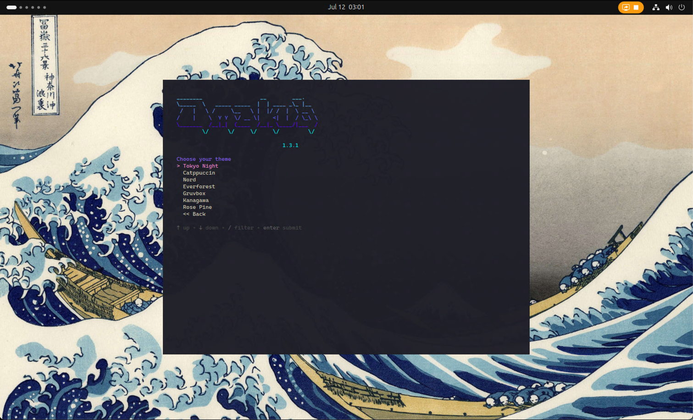

# Installing Omakub on a Proxmox Virtual Machine

I recently found myself in a common homelab dilemma: I needed a dedicated machine for a jumphost and remote development environment, but all my spare hardware was already tied up with my Proxmox server running other services. So, I decided to leverage my existing Proxmox setup and install [Omakub](https://omakub.org/) inside a virtual machine.

Omakub, based on Ubuntu, provides a clean and efficient workspace, perfect for keeping my main PC clutter-free while still having a powerful Linux environment at my fingertips. This guide will walk you through setting up a fresh Ubuntu 24.04 VM in Proxmox and then installing Omakub.

### VM Specification

For this setup, I allocated the following resources to my Proxmox VM:

*   **VCPU:** 8
*   **RAM:** 16 GB
*   **Storage:** 512 GB SSD

### Step by Step: Ubuntu 24.04 Installation (Proxmox VM)

1.  **Download Ubuntu 24.04 ISO:**
    First, grab the official Ubuntu 24.04 Desktop ISO from the Ubuntu website.
    [https://releases.ubuntu.com/24.04/](https://releases.ubuntu.com/24.04/)

2.  **Create a New VM in Proxmox:**
    Follow the standard Proxmox procedure to create a new virtual machine.
    *   Mount the downloaded Ubuntu ISO as a CD/DVD drive.
    *   Configure the VM with the specifications mentioned above (8 VCPU, 16 GB RAM, 512 GB SSD).
    *   Ensure you select "Qemu Agent" in the VM options for better integration.

3.  **Install Ubuntu 24.04:**
    Boot the VM and proceed with a fresh installation of Ubuntu 24.04 Desktop. Follow the on-screen prompts to set up your user, timezone, etc.

### Post-Installation Setup

Once Ubuntu is installed and you've rebooted into your fresh desktop, perform these crucial steps before installing Omakub:

0.  **Update all repositories:**
    ```bash
    sudo apt update && sudo apt upgrade -y
    ```
    If a reboot is requested after the update, go ahead and reboot your VM.

1.  **Install essential tools:**
    ```bash
    sudo apt install -y vim qemu-guest-agent openssh-server
    ```

2.  **Enable and start services:**
    ```bash
    sudo systemctl enable --now qemu-guest-agent
    sudo systemctl enable --now ssh
    ```

### Enable Remote Desktop

After ensuring your system is updated and services are running, you can enable Remote Desktop for easier access.

1.  Open **Settings** > **System** > **Remote Desktop**.
2.  Toggle **Remote Desktop** to ON.
3.  For **Remote Login**, you can choose to set a specific port (the default RDP port is 3389).
4.  Set your desired username and password for remote access.

Now, you can test connecting to your Ubuntu VM using an RDP client. I use Microsoft Remote Desktop on my Mac.

### Omakub Installation

Once you have successfully connected to your Ubuntu VM via RDP, you can proceed with the Omakub installation using their convenient one-line script.

Open a terminal in your Ubuntu VM and run:

```bash
wget -qO- https://omakub.org/install | bash
```

Follow the on-screen prompts to select your preferred options. The installation will take some time and will eventually request a reboot.


### Post-Omakub Installation & Troubleshooting

After Omakub is installed and your VM has rebooted, try to connect again via RDP.

*   **Xorg Session:** Omakub uses Xorg. If you experience lagging or a black screen upon login, ensure you select "Ubuntu on Xorg" after entering your username and before typing your password. Look for a small gear icon (or similar) in the bottom right corner of the login screen to choose the session type.

*   **RDP Black Screen Troubleshooting (macOS Microsoft Remote Desktop):**
    If you encounter a black screen specifically when using Microsoft Remote Desktop on macOS, you might need to adjust the RDP connection file:
    1.  Right-click on your existing connection in Microsoft Remote Desktop.
    2.  Select "Export" to save the connection settings as an `.rdp` file.
    3.  Open the saved `.rdp` file with a text editor.
    4.  Locate the line:
        ```
        use redirection server name:i:0
        ```
    5.  Change it to:
        ```
        use redirection server name:i:1
        ```
    6.  Save the modified file.
    7.  Import the edited file as a new connection in Microsoft Remote Desktop.

    For more details, you can refer to this Reddit thread: [https://www.reddit.com/r/Ubuntu/comments/1csoi05/2404_cannot_connect_via_rdp/?utm_source=share&utm_medium=web3x&utm_name=web3xcss&utm_term=1&utm_content=share_button](https://www.reddit.com/r/Ubuntu/comments/1csoi05/2404_cannot_connect_via_rdp/?utm_source=share&utm_medium=web3x&utm_name=web3xcss&utm_term=1&utm_content=share_button)

### Troubleshooting Keyboard Shortcuts (Super Key Conflicts)

A common issue when using Remote Desktop from macOS to a Linux VM (especially with Omakub) is that macOS's system-level shortcuts can conflict with the VM's shortcuts, particularly those involving the `Super` key (Cmd key on Mac). For example, `Super+Space` often triggers Spotlight on macOS instead of Omakub's application launcher.


To resolve this, you can adjust the hotkeys within Omakub to avoid conflicts:

*   **Ulauncher ("Type app to launch"):**
    *   **Original:** `Super + Space`
    *   **New:** `Shift + Super + Space`
    *   You can find and modify this shortcut within Omakub's settings, often under "Keyboard" or "Custom Shortcuts," specifically looking for `Ulauncher`.

*   **"See all apps" (System):**
    *   **Original:** `Super + A`
    *   **New:** `Shift + Super + A`

*   **"Close app" (Windows):**
    *   **Original:** `Super + W`
    *   **New:** `Shift + Super + W`

By changing these keybindings in Omakub, you allow macOS to retain its system-level shortcuts while still having access to Omakub's features with non-conflicting combinations.

### Conclusion

You've now successfully installed Omakub on an Ubuntu 24.04 virtual machine within Proxmox! This setup provides a powerful and isolated environment for your jumphost and remote development needs, all while leveraging your existing homelab infrastructure. Enjoy your clean main PC and your new Omakub workspace!



### References

*   [Omakub Official Website](https://omakub.org/)
*   [Omamix Manuals: Getting Started](https://manuals.omamix.org/1/read/4/getting-started)
*   [I Installed Omakub Five Times So You Can Do It Just Once - dev.to](https://dev.to/tacoda/i-installed-omakub-five-times-so-you-can-do-it-just-once-2ek8)
*   [Ubuntu 24.04 Cannot Connect via RDP - Reddit](https://www.reddit.com/r/Ubuntu/comments/1csoi05/2404_cannot_connect_via_rdp/?utm_source=share&utm_medium=web3x&utm_name=web3xcss&utm_term=1&utm_content=share_button)