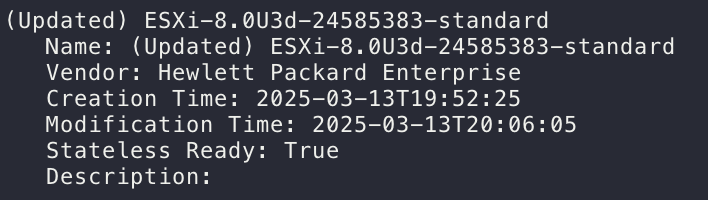

# ESXi Version Update

This guide details how to update the ESXi version using the command-line interface (CLI). CLI updates are ideal when you need a controlled, automated update process. Let's dive in!

## Online ESXi Update via CLI

1.  **Check the ESXi Version:**

    First, let's verify the current ESXi version. You can find this information in the web interface:

    

2.  **SSH into the ESXi Host:**

    Enable SSH access (Left navigation, Host Page, ⚙︎ Actions > Services > Enable Secure Shell (SSH)).

    Connect to your ESXi host using SSH. Replace the IP address with your host's IP.

    ```bash
    ssh root@192.168.0.100 # adjust the username and IP address
    ```

    Use the CLI to check the ESXi version:

    ```bash
    vmware -v

    ### Output
    # VMware ESXi 8.0.2 build-23825572
    ```

3.  **Check the Latest Installation/Update Activity:**

    Let's check the installation date of the current ESXi version. This helps ensure we're starting from a known point:

    ```bash
    esxcli software vib list | grep 'Install\|esx-base'

    ### Output
    # Name                           Version                               Vendor  Acceptance Level  Install Date  Platforms
    # esx-base                       8.0.2-0.40.23825572                   VMware  VMwareCertified   2024-05-24    host
    ```

4.  **Check ESXi Version and Profile Before the Update:**

    Confirm the current ESXi version and profile using this command:

    ```bash
    esxcli software profile get
    ```

    

5.  **Enable Firewall Rule for Internet Access:**

    Enable the `httpClient` firewall rule to allow the ESXi host to access the VMware online depot:

    ```bash
    esxcli network firewall ruleset set -e true -r httpClient
    ```

6.  **Check Available Images in the VMware Online Depot:**

    Now, let's see which ESXi versions are available for update:

    ```bash
    esxcli software sources profile list --depot=https://hostupdate.vmware.com/software/VUM/PRODUCTION/main/vmw-depot-index.xml
    ```

    Or, use this command:

    ```bash
    LANG=en_US.UTF-8 /usr/lib/vmware/esxcli-software sources.profile.list -d "https://hostupdate.vmware.com/software/VUM/PRODUCTION/main/vmw-depot-index.xml"
    ```

    > ⚠️ **Note for ESXi 8.x and above:**
    >
    > You might encounter a `[MemoryError]` due to a fixed memory limit for ESXCLI.
    >
    > Check the current memory limit:
    >
    > ```bash
    > grep 'mem=' /usr/lib/vmware/esxcli-software
    >
    > ### Output
    > # #!/usr/bin/python ++group=esximage,mem=300
    > ```
    >
    > Increase the memory limit from 300MB to 500MB:
    >
    > ```bash
    > esxcli system settings advanced set -o /VisorFS/VisorFSPristineTardisk -i 0
    > cp /usr/lib/vmware/esxcli-software /usr/lib/vmware/esxcli-software.bak
    > sed -i 's/mem=300/mem=500/g' /usr/lib/vmware/esxcli-software.bak
    > mv /usr/lib/vmware/esxcli-software.bak /usr/lib/vmware/esxcli-software -f
    > esxcli system settings advanced set -o /VisorFS/VisorFSPristineTardisk -i 1
    > ```
    >
    > After increasing the memory limit, rerun the command to check available images.

7.  **Filter Images (Optional):**

    The list of available images can be quite long. Use `grep` to filter by year or a specific version. In this example, we're filtering for `ESXi-8.0U3d-24585383-standard`:

    ```bash
    esxcli software sources profile list --depot=https://hostupdate.vmware.com/software/VUM/PRODUCTION/main/vmw-depot-index.xml | grep 2025

    ### Output
    # ESXi-7.0U3s-24585291-standard     VMware, Inc.  PartnerSupported  2025-03-04T00:00:00  2025-03-04T00:00:00
    # ESXi-7.0U3s-24585291-no-tools     VMware, Inc.  PartnerSupported  2025-03-04T00:00:00  2025-02-21T03:24:14
    # ESXi-8.0U2d-24585300-standard     VMware, Inc.  PartnerSupported  2025-03-04T00:00:00  2025-03-04T00:00:00
    # ESXi-8.0U2d-24585300-no-tools     VMware, Inc.  PartnerSupported  2025-03-04T00:00:00  2025-02-21T03:56:44
    # ESXi-8.0U3d-24585383-no-tools     VMware, Inc.  PartnerSupported  2025-03-04T00:00:00  2025-03-04T00:00:00
    # ESXi-8.0U3d-24585383-standard     VMware, Inc.  PartnerSupported  2025-03-04T00:00:00  2025-03-04T00:00:00
    ```

8.  **Enter Maintenance Mode:**

    Before updating, put the ESXi host into maintenance mode. **Important:** Shut down all VMs running on the host first!

    ```bash
    esxcli system maintenanceMode set --enable=true
    ```

9.  **Execute the Update:**

    Upgrade to the chosen build profile. Replace `ESXi-8.0U3d-24585383-standard` with the desired profile name.

    ```bash
    esxcli software profile update -p ESXi-8.0U3d-24585383-standard -d https://hostupdate.vmware.com/software/VUM/PRODUCTION/main/vmw-depot-index.xml
    ```

    If you encounter a `[HardwareError]` due to unsupported CPU, use the `--no-hardware-warning` flag:

    ```bash
    esxcli software profile update -p ESXi-8.0U3d-24585383-standard -d https://hostupdate.vmware.com/software/VUM/PRODUCTION/main/vmw-depot-index.xml --no-hardware-warning
    ```

10. **Wait for Completion:**

    The upgrade process will take some time. Be patient!
11. **Disable Internet Access:**

    Once the upgrade completes, disable internet access for security:

    ```bash
    esxcli network firewall ruleset set -e false -r httpClient
    ```

12. **Reboot the Host:**

    Reboot the ESXi host to apply the updates.

    ```bash
    reboot
    ```

13. **Enable SSH:**

    After rebooting, access the web interface and re-enable SSH access.
14. **Disable Maintenance Mode:**

    Take the ESXi host out of maintenance mode:

    ```bash
    esxcli system maintenanceMode set --enable=false
    ```

15. **Check Profile (Again):**

    Verify the updated ESXi profile:

    ```bash
    esxcli software profile get
    ```

    

# Reference

-   [Updating VMware ESXi Host from the Command Line (ESXCLI)](https://woshub.com/update-vmware-esxi/)
-   [Quick Tip - Using ESXCLI to upgrade ESXi 8.x throws MemoryError or Got no data from process](https://williamlam.com/2024/03/quick-tip-using-esxcli-to-upgrade-esxi-8-x-throws-memoryerror-or-got-no-data-from-process.html)
-   [https://thenicholson.com/updating-esxi-using-esxcli-broadcom-tokens/](https://thenicholson.com/updating-esxi-using-esxcli-broadcom-tokens/)
-   [https://knowledge.broadcom.com/external/article/343840/patching-esxi-host-using-command-line.html](https://knowledge.broadcom.com/external/article/343840/patching-esxi-host-using-command-line.html)