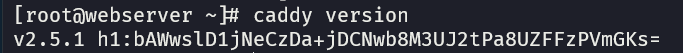
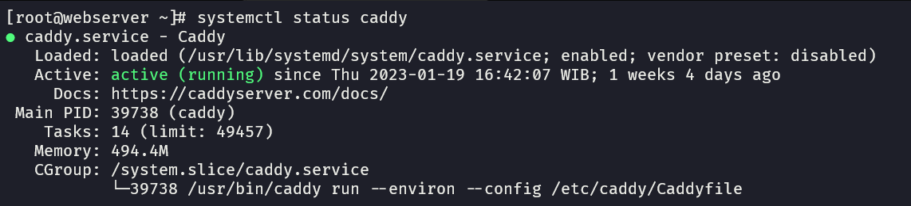
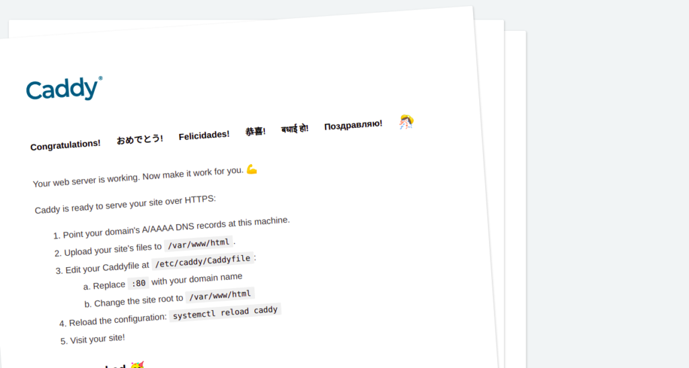

# Install Caddy on Rocky Linux 8.x

Alternative Web Server besides Apache and Nginx. Installation on Rocky Linux 8.x

### Preparation
You can connect to the server via SSH or console.
```bash
ssh [username]@[ip_server] -p [ssh_port]
```

Update the system 
```bash
sudo dnf update
```

Add caddy repository
```bash
sudo dnf install 'dnf-command(copr)'
sudo dnf copr enable @caddy/caddy
```


### Installation
Install Caddy
```bash
sudo dnf install caddy
```

Check Caddy Version
```bash
caddy version
```

Sample Output of Caddy version




### Set Firewall
#### Allow HTTP & HTTPS
```bash
sudo firewall-cmd --permanent --zone=public --add-service=http
sudo firewall-cmd --permanent --zone=public --add-service=https
```

#### Restart Firewall
```bash
sudo firewall-cmd --reload
```

### Start Service
```bash
sudo systemctl enable --now caddy
sudo systemctl start caddy
sudo systemctl status caddy
```

Sample Output of Service status


### Access the sample page

Open [http://localhost](http://localhost) or [http://<your_server_ip>](http://127.0.0.1) to access the sample page.

Output of Caddy sample page


