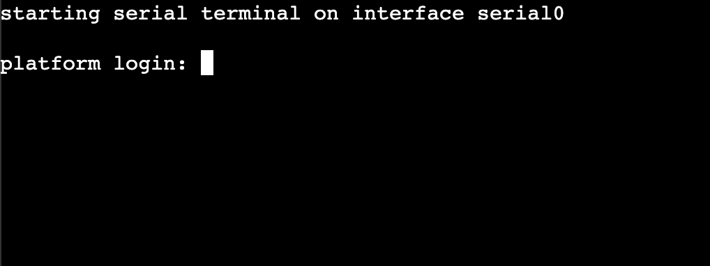

# Accessing Virtual Labs
This documentation provides a step-by-step guide for accessing virtual labs using public IPv6 addresses using SSH, noVNC, and Xterm.js. Virtual labs allow users to simulate real-world environments for learning, development, and testing purposes.

## Accessing Virtual Labs using SSH
### Programs for using SSH:

- Linux → Terminal
- macOS → Terminal, iTerm
- Windows → CMD, Terminal, WSL

### Find Public IP
You can find your public IP here. 8Labs only provides public IPv6 for virtual labs.


If you cannot connect to public IPv6 because your home network doesn't have IPv6, the easiest way is to use [WARP by Cloudflare](https://one.one.one.one/) (free) as a VPN or [Tunnel Broker](https://tunnelbroker.net/) solution. 


### Check IPv6 Connectivity
You can check IPv6 connectivity here: [test-ipv6.com](https://test-ipv6.com/) 


### Execute SSH
Type this command in your terminal to connect to your machine:
```bash
ssh <username>@<public_ip> -p <ssh_port>
# example user 'root' connecting to public IPv4
ssh root@123.321.123.321 -p 22
# example user 'ubuntu' connecting to public IPv6
ssh ubuntu@2403:6ac0:3:9d:20c:29ff:feb2:6e0e -p 22
```

After you run the SSH command for the first time, you will be asked about the fingerprint. You can just type "yes" to store the fingerprint.


Then type in your `password`. It will not appear on the terminal screen, so make sure you type it correctly.

This is the landing information about your machine.


## Accessing Virtual Labs using noVNC

1. **Access from cloud.8labs.id**: Open your browser and go to [cloud.8labs.id](https://cloud.8labs.id).
2. **Click here**: 
3. **Redirect to web console**: You will be redirected to the noVNC web console.
4. **Login using credentials**: Use the default username `root` and the password you set.


## Accessing Virtual Labs using Xterm.js

1. **Access from cloud.8labs.id**: Open your browser and go to [cloud.8labs.id](https://cloud.8labs.id).
2. **Click here**: 
3. **Redirect to web console**: You will be redirected to the Xterm.js web console.
4. **Once the screen appears**: press "Enter" on your keyboard.

5. **Login using credentials**: Use the default username `root` and the password you set.


By following these steps, you can seamlessly access virtual labs using SSH over public IPv6 addresses, noVNC, and Xterm.js.
